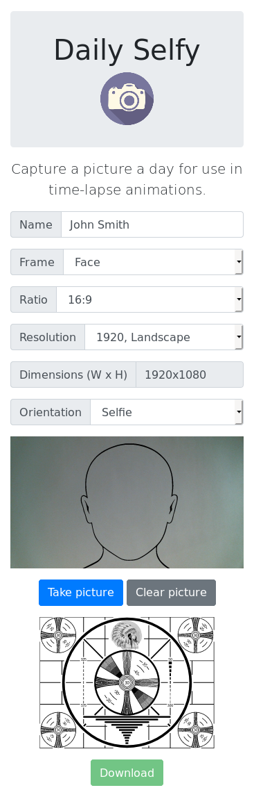

# Daily Selfy

TODO: Add Netlify Link

TODO: Add Netlify Badge

## Summary

Capture a picture a day for use in time-lapse animations.

## Background

Have you ever wanted to make a long-duration selfie time-lapse animation, but were turned off by overly-complicated Android and iOS apps? I was, so I made this.

Details:

* Nothing to install - it's just a fully-responsive HTML5 webpage.
* No cloud storage to deal with - save your images directly to your device.
* Works equally well with laptops (default orientation) and phones/tablets (standard or selfie orientation).
* When taking selfies, optionally overlay a face-shaped frame to assist with aligning your image and cut down on required post-processing work.

## Screenshot

